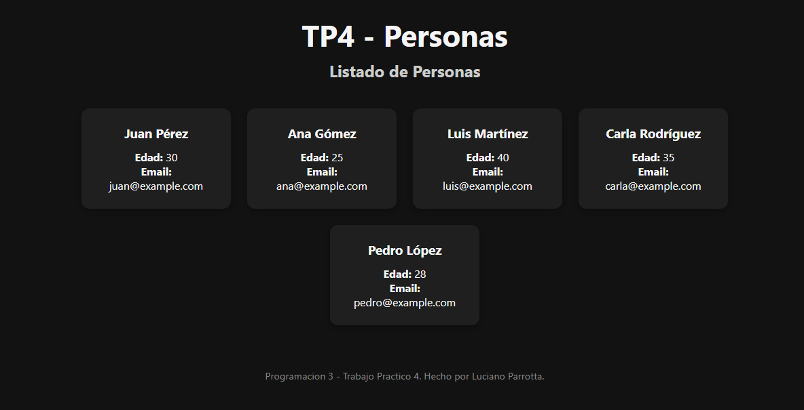

# TP4; Lista de Personas - Programación 3:

---

## Tecnologías Utilizadas

### Backend
- [Node.js](https://nodejs.org/)
- [Express.js](https://expressjs.com/)
- [CORS](https://www.npmjs.com/package/cors)

### Frontend
- [React](https://react.dev/)
- [Vite](https://vitejs.dev/)
- [Axios](https://axios-http.com/)
- CSS

---

## Para ejecutar el proyecto:

### 1. Clonar el proyecto o descargalo

  tener **Node.js** instalado.

### 2. Ejecutar el Backend

```bash
cd Backend
npm install
node server.js
```

El servidor se levantara en: `http://localhost:3000`

---

### 3. Ejecutar el Frontend

ejecutar lo siguiente otra terminal:

```bash
cd Frontend
npm install
npm run dev
```

La app se levantara en: `http://localhost:5173`

---

## Funcionalidad

- El backend expone una ruta `GET /personas` que devuelve un array con 5 personas (JSON).
- El frontend consulta esa ruta al iniciar la app.
- Muestra cada persona en una **tarjeta visual** con nombre, apellido, edad y email.

---

## Vista previa

